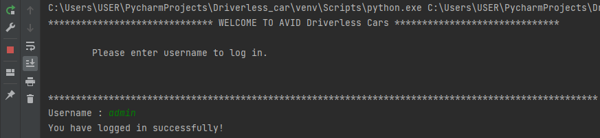
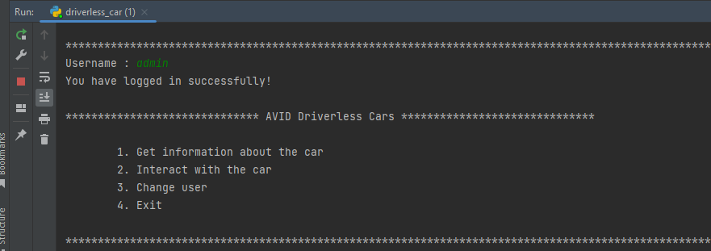
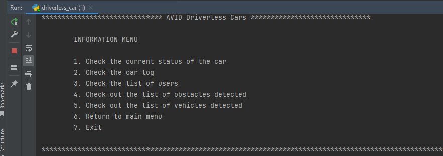
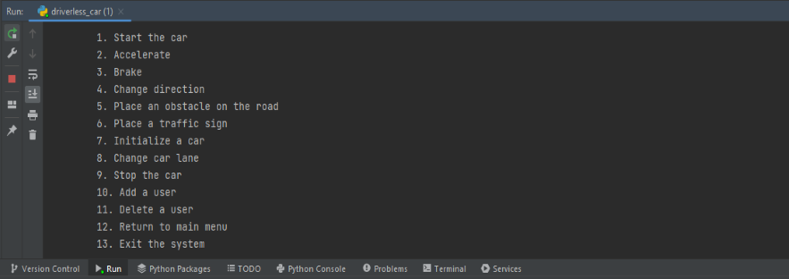
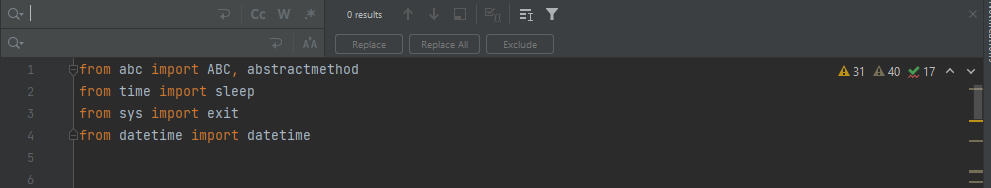
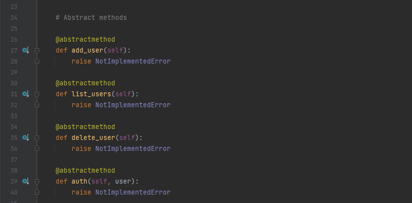
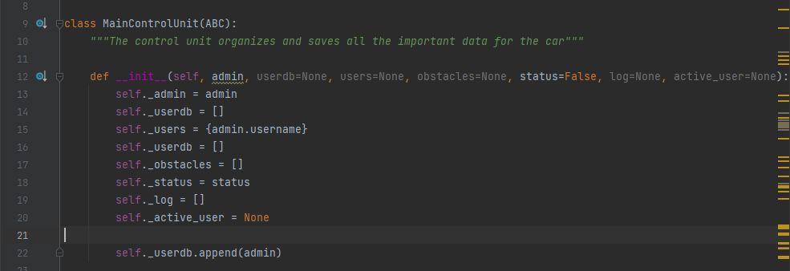

# Driverless Car

The main objective of this project is to develop a system that supports the operation of a driverless car using python.
This application uses a text-based interface i.e.(There is no GUI-based interface). When the software is executed, the user is presented with the login screen. For easier usage, simply a username **admin** is needed to access the system (no password is needed). On successful login, the user is presented with the various features to choose from. More users can be created by the admin to enable them use the software. 

## Assumptions

The following assumptions were made for the software:
1.  The initial speed is set to 0 when the car is off and then increased to 60 when the car is started.
2.  It is assumed that the car travels on a three-lane road with the first lane from the right being the slowest.
3.  It is also assumed that the 
4.  The car is assumed to only travel in two directions North(N) and South(S).
5.  It is also assumed that there is two-way traffic on the route.

## Features 

 The following features were introduced in the software;
 - Change, add, and delete a user
 - Start and stop car
 - Accelerate and reduce the speed of the car
 - Change direction of the car
 - Change car lane on the road
 - Place an obstacle
 - Put a traffic sign 
 - Initiate a car
 - The user is able to check if the car is on/off, check the car log, and also print out all the users of the system and also the various cars and obstacles detected.

## Methodology

During the development of this system, the following **data structures** were used;
- Lists
- Stacks
- Queues
- Dictionaries
- Sets 

**External modules** were also introduced in the system to support **object oriented programming (OOP)**, such as;
- **ABC classes** and **abstract methods decorator** were used to design the abstract classes and methods in the system.
- **Datetime(datetime)** was employed to produce a timestamp for the database of identified obstacles and car logs.
- **Sys exit()** function: When the user wishes to leave the system, a function is utilized.
- **Time sleep()** function was employed to briefly stop the interface and make the output easier to read.

A blueprint for other classes might be thought of as an **Abstract class**. You may use it to define a collection of methods that are required for all subclasses derived from the abstract class.(Geeks for Geeks, 2021) They were created as a model for the classes that will be utilized in the software. The methods of abstract classes produce NotImplementedError because they lack implementation, and all of their methods are decorated with the abstractmethod decorator. When developing classes, special attention was made to overriding all methods of abstract classes in order to ensure that the interfaces are rigorously adhered to. Additionally, the attributes of the classes were accessed and changed outside of the object using getter and setter methods.

Two types of objects were used in this system;
- **Mutable/Temporary Objects** which are created in runtime were used in cases of when a user chooses to place an obstacle in the path, for instance, an Obstacle object is constructed depending on user input (Campbell, 2022).
- **Immutable/Permanent Objects** which are created in compile time were used. Immutable objects cannot be changed(Hein, 2021). As an illustration, the program's permanent objects include the automobile, control unit, LiDAR, Traffic Sign Recognition System, and V2V Communication Module. As a result, classes' method definitions employ direct references to object methods to send information to these objects.

## References

Campbell, S. (2022) Mutable & Immutable Objects in Python {EXAMPLES}, 8 November 2022. *Guru99*. Available from: https://www.guru99.com/mutable-and-immutable-in-python.html [Accessed 24 October 2022]
Geeks for Geeks. (2021) Abstract Classes in Python. Available from: https://www.geeksforgeeks.org/abstract-classes-in-python/ [Accessed 25 October 2022]
Hein, Y. M. (2021) Python Objects 101 — Mutable vs Immutable. 13 January 2021. *Medium*. Available from: https://medium.com/swlh/python-objects-101-mutable-vs-immutable-e3e5e2245913 [Accessed 24 October 2022]
