## Test Cases 

To test the software you must first log in into the system using the username-**admin**.

### Test 1
For the first test, the **Add a user** feature is tested using the following instructions;
1.  After logging in  into the system select option **2** - Interact with the car.
2.  Select option **10** - Add a user.
3.  Set **Name: Uthman**
4.  Set **Surname: Adams**
5.  Set **Username: adman**
6.  On success select **12 - Return to main menu**
7.  To confirm if it worked we will change the user. Select **3 - Change user**
8.  Set **Username: adman**
9.  Now select **2 - Interact with the car**
10. The user is then deleted. Select **11 - Delete a user**(An attempt to delete the active user is not allowed to do this the user must be changed to admin)
11. Set **Username: admin**
12. Select **11 - Delete a user**
13. Set **Username: adman** and the user is deleted successfully.
14. To confirm the test, select **12- Return to main menu**, > **1 - Get information about the car** and then **2 - Check the car log**.

Bellow is the result of the above test that was carried out.
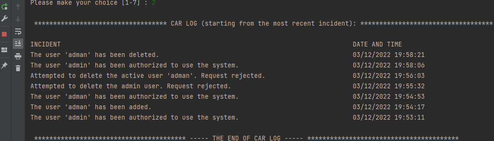

### Test 2
For the second test, we will be testing the behavior of the car based on the users' input
1.  On successful log in, select **2 - Interact with the car**.
2.  Select **9 - Stop the car**(It should display a message when this is attempted)
3.  Select **1 - start the car**
4.  Select **3 - brake**
5.  Select **8 - change lane** > **2 - lane 2**
6.  Select **2 - Accelerate** > **2 - Accelerate**
7.  Select **4 - change direction**
8.  Select **3 - brake**
9.  Select **8 - change lane** > **lane 1**
10. Select **9 - Stop the car**
11. Select **3 - brake** (This should display a message that the car is already stopped)

Below is the result of the test.
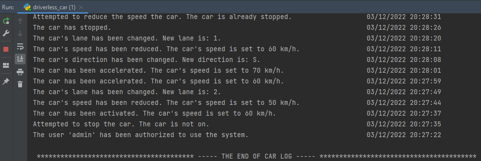

### Test 3
For the third test, the **Object detection** feature is tested.
1.  On succesfull login, select **2 - Interact with the car**
2.  Now select **1 - Start the car**
3.  Select **5 - Place an obstacle**
4.  Select **1 - Rock** > **Lane - 1**
5.  Select **5 - Place an obstacle** > **2 - Pedestrian** > **Lane 3**
6.  Select **5 - Place an obstacle** > **3 - Animal** > **Lane 2**
7.  Select **2 - Accelerate**
8.  Select **2 - Accelerate**
9.  Select **5 - Place an obstacle** > **4 - Trash** > **Lane 1**
10. Select **2 - Accelerate**
11. Select **2 - Accelerate**
12. Select **5 - Place an obstacle** > **5 - Cone** > **Lane 2**
13. Select **3 - Brake**
14. Select **3 - Brake**
15. Select **9 - Stop the car** 
16. return to the main menu, select **1 - Get information about the car** > **4 - Check the list of obstacles detected**.

Below is the result of the test
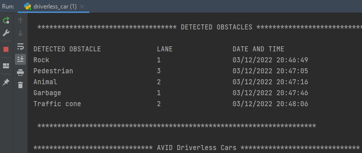

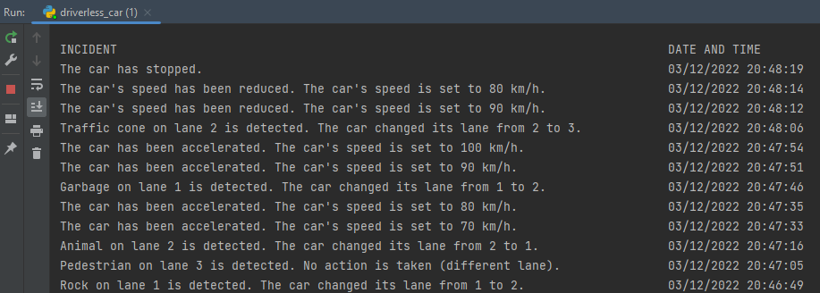
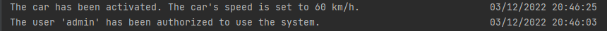

### Test 4
For the fourth test, the **Detect traffic signs** is tested.
1.  On successful login, select **2 - Interact with the car**
2.  Now select **1 - Start the car**
3.  Select **6 - Put a traffic sign**
4.  Select **3- Stop the car**
5.  Select **2 - Accelerate**
6.  Select **2 - Accelerate**
7.  Select **2 - Accelerate**
8.  Select **6 - Put a traffic sign** > **5 - Minimum Speed Limit (60 km/h)**
9.  Select **2 - Accelerate** and accelerate the car four times
10. Select **6 - Put a traffic sign** > **2 - Speed Limit (100 km/h)**
11. Select **6 - Put a traffic sign** > **4 - Caution! Slippery road**
12. Return to main menu and check the log.

Below are the results of the test.
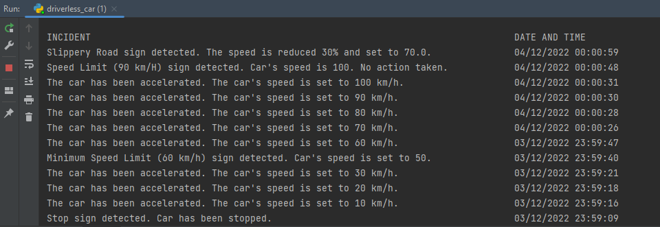
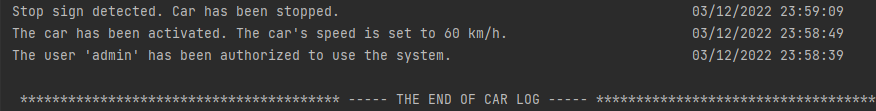

### Test 5
For the fifth test, the **V2V Communication** feature is tested.
1.  On successful login, select **2 - Interact with the car**
2.  Now select **1 - Start the car**
3.  Select **7 - initialize a car**
4.  Select **1 - Car** > **Set speed to 120** > **Set direction to N** > **Set lane to 2**
5.  Select **2 - Accelerate** three times
6.  Select **8 - Change lane** > **Lane 2**
7.  Select **7 - initialize a car**
8.  Select **4 - Truck/lorry** > **Set speed to 70** > **Set direction to S** > **Set lane to 1**
9.  Return to main menu and check the log.

Below are the results of the test.
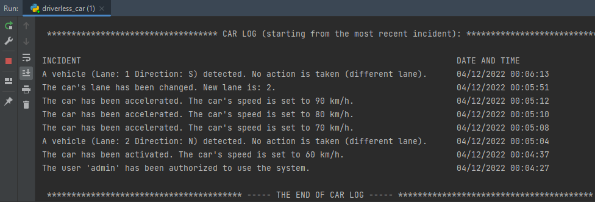

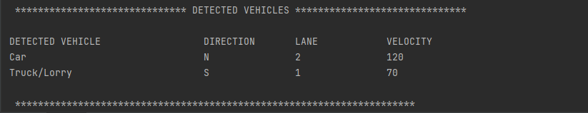

### Test 6
For the the sixth test, a series of features were tested.
1.  On successful login, select **2 - Interact with the car**
2.  Now select **1 - Start the car**
3.  Select **2 - Accelerate**
4.  Select **2 - Accelerate**
5.  Select **8 - change lane** > **2 - lane 2**
6.  Select **3 - brake**
7.  Select **4 - change direction**
8. Select **5 - Place an obstacle** > **5 - Cone** > **Lane 2**
9. Select **2 - Accelerate**
10. Select **2 - Accelerate**
11. Select **2 - Accelerate**
12.  Select **6 - Put a traffic sign** > **5 - Minimum Speed Limit (60 km/h)**
13.  Select **3 - brake**
14.  Select **7 - initialize a car**
15.  Select **2 - Van** > **Set speed to 70** > **Set direction to S** > **Set lane to 2**
16.  Select **3 - brake**
17.  Select **3 - brake**
18. Select **9 - Stop the car** 
19. Return to main menu and check car log.

Below are the results of the test.
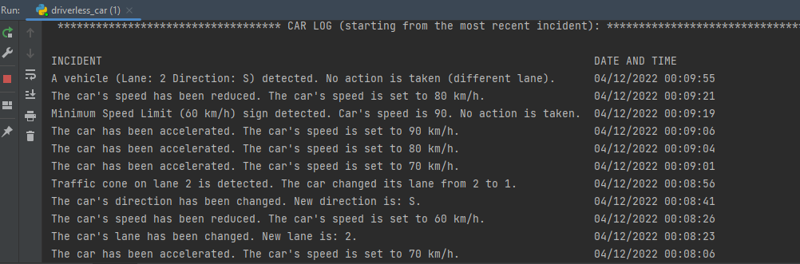
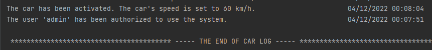

